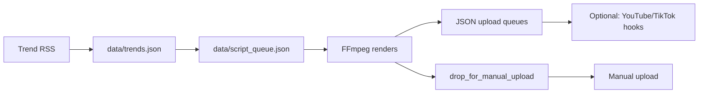

# Manual upload workflow (no TikTok API)

Each pipeline run fills **`output/drop_for_manual_upload/`** with one folder per video. Use this when you prefer to upload from your phone or from YouTube/TikTok UIs instead of API approval.

## Quick path: `latest/`

After each run, the **newest** script (by `created_at`) is also copied to:

`output/drop_for_manual_upload/latest/`

Same files as a single-ID folder, plus **`SCRIPT_ID.txt`**. Use this when you only want one bundle to upload.

## What gets created

For each `script_id`:

| File | Purpose |
|------|---------|
| `video.mp4` | Copy of the rendered short (if render succeeded) |
| `tiktok_caption.txt` | Paste as TikTok caption |
| `youtube_title.txt` | Paste as YouTube title |
| `youtube_description.txt` | Paste as YouTube description |
| `README.txt` | Quick reminder |
| `VIDEO_MISSING.txt` | Only if FFmpeg/media was missing (dry run) |

`_summary.json` at the drop root lists counts and paths.

## How to start (minimal)

1. **Python 3.10+** and **`pip install -r requirements.txt`**
2. **FFmpeg** on PATH and real files under `assets/media/` (see repo README)
3. **Legal assets** in `assets/licenses/manifest.csv`
4. Run once:

```bash
python src/main.py --base-dir .
```

5. Open **`output/drop_for_manual_upload/<script_id>/`** and upload:
   - **YouTube:** Studio → Upload → Shorts; paste title/description from the `.txt` files
   - **TikTok:** App → Upload → pick `video.mp4` → paste `tiktok_caption.txt`

## How the full system works (high level)



1. **Ingest** — Pulls ideas from RSS into `data/trends.json`
2. **Scripts** — Builds short scripts + metadata (titles, TikTok caption) into `data/script_queue.json`
3. **Render** — Writes FFmpeg jobs; if FFmpeg + media exist, writes `output/renders/<id>.mp4`
4. **Queues** — `youtube_upload_queue.json` / `tiktok_upload_queue.json` for API or scheduling
5. **Manual drop** — Same videos + text files for hand-upload
6. **Optional autonomous mode** — `src/autonomous_service.py` runs the pipeline on a schedule and can call your upload/metrics commands (see `ops/autonomous_service_setup.md`)

## YouTube vs TikTok here

- **YouTube:** OAuth + Data API upload script is supported in-repo (`src/integrations/upload_to_youtube.py`)
- **TikTok:** Official posting API needs developer app approval; **manual drop avoids that** until you are ready
